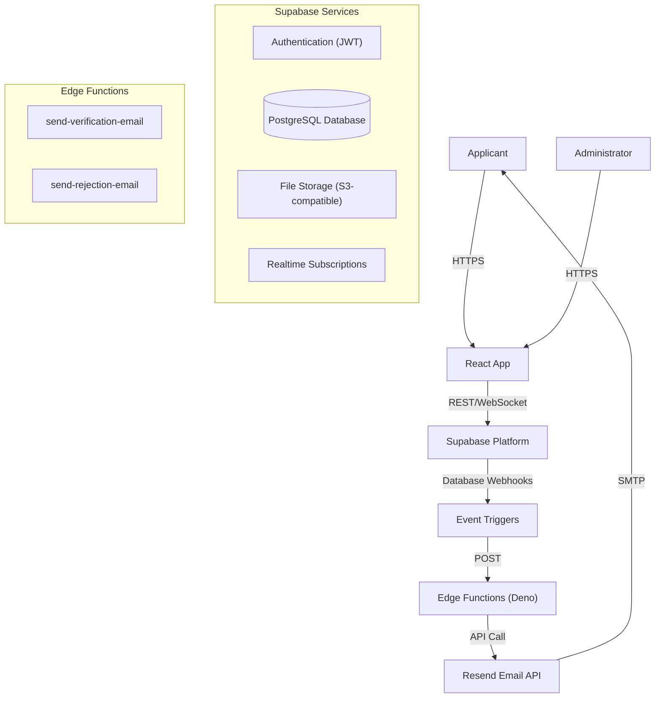

# MMR Burwan - Marriage Registration Portal


**MMR Burwan** (Marriage Registrar Burwan) is a comprehensive, enterprise-grade digital platform designed to digitize and streamline the marriage registration process for the region of Burwan. It replaces legacy manual paperwork with a secure, transparent, and automated digital workflow, serving both citizens (applicants) and government officials (administrators).

---

## 📚 Table of Contents
1. [Project Overview](#-project-overview)
2. [System Architecture](#-system-architecture)
3. [Key Features & Workflows](#-key-features--workflows)
4. [Database Schema & Data Model](#-database-schema--data-model)
5. [Security & Privacy](#-security--privacy)
6. [Folder Structure](#-folder-structure)
7. [Technical Highlights](#-technical-highlights)
8. [Getting Started & Deployment](#-getting-started--deployment)

---

## 🔭 Project Overview

The platform serves two primary user groups with distinct interfaces and permissions:

### 1. Applicants (Citizens)
- **Digital Application**: A guided, multi-step wizard to submit marriage details (Groom, Bride, Witnesses).
- **Document Vault**: Secure upload and management of ID proofs (Aadhaar, Voter ID, etc.).
- **Appointment Booking**: Real-time slot booking for physical verification at the registrar's office.
- **Status Tracking**: Live updates on application status (Draft → Submitted → Verified/Rejected).
- **Certificate Access**: Instant download of digitally signed marriage certificates.

### 2. Administrators (Officials)
- **Command Center**: A dashboard view of all applications with filtering and sorting.
- **Verification Suite**: Tools to view documents side-by-side with application data for verification.
- **Rejection Management**: Granular rejection system with automated email notifications explaining the reason.
- **Certificate Issuance**: One-click generation of unique, traceable certificate numbers.

---

## 🏗 System Architecture

The project follows a **Modern Serverless Architecture** leveraging the **Supabase** ecosystem. This ensures high availability, scalability, and zero server management overhead.

### Tech Stack
- **Frontend**: 
    - **Framework**: React 18 (Vite) for high performance.
    - **Language**: TypeScript for type safety.
    - **Styling**: Tailwind CSS for responsive, utility-first design.
    - **State Management**: React Context API.
    - **Internationalization**: `react-i18next` (English & Bengali).
- **Backend (BaaS)**: 
    - **Supabase**: Provides Auth, Database, Storage, and Realtime subscriptions.
- **Compute (Serverless)**: 
    - **Supabase Edge Functions**: Deno-based serverless functions for backend logic (Email sending, complex validation).
- **Communication**: 
    - **Resend.com**: Transactional email API for reliable delivery.

### Architecture Diagram


---

## 🚀 Key Features & Workflows

### A. The Application Lifecycle
1.  **Drafting**: Users can start an application and save it as a draft. Data is validated using `Zod` schemas.
2.  **Submission**: Once submitted, the application is locked for editing and moves to the Admin queue.
3.  **Review**: Admins review the data.
    - **Rejection**: If rejected, the status reverts, and the user is notified to correct errors.
    - **Verification**: If approved, the status becomes `verified`.

### B. Event-Driven Notification System
We utilize an **Event-Driven Architecture** to decouple the frontend from side effects like emails.
- **Mechanism**: 
    1. Admin performs an action (e.g., rejects a document).
    2. Frontend inserts a record into the `notifications` table.
    3. **Database Webhook** detects the `INSERT`.
    4. **Edge Function** (`send-rejection-email`) is triggered.
    5. Email is sent.
- **Benefit**: This ensures that even if the Admin's browser crashes immediately after the action, the email is guaranteed to be sent by the backend.

### C. Appointment System
- **Slot Management**: Admins define available slots.
- **Concurrency Control**: The database ensures that two users cannot book the same slot simultaneously.
- **QR Code**: Upon booking, a QR code is generated for easy check-in at the office.

---

## 💾 Database Schema & Data Model

The core data model is built on **PostgreSQL**. Key tables include:

| Table Name | Description | Key Relationships |
| :--- | :--- | :--- |
| `users` | Extends Supabase Auth with app-specific profile data. | `id` references `auth.users` |
| `applications` | The central record for a marriage registration. | `user_id` references `users` |
| `documents` | Metadata for uploaded files. | `belongs_to` references `applications` |
| `appointments` | Booking slots and status. | `user_id` references `users` |
| `notifications` | System alerts and email triggers. | `user_id` references `users` |

---

## � Security & Privacy

Security is paramount for government applications.

1.  **Row Level Security (RLS)**:
    - We strictly enforce RLS policies on all tables.
    - **Applicants** can ONLY `SELECT`, `INSERT`, `UPDATE` their own rows (`user_id = auth.uid()`).
    - **Admins** have a special role that grants access to all rows for processing.
    
2.  **Secure Storage**:
    - Documents are stored in private Supabase Storage buckets.
    - Access is granted only via **Signed URLs** with short expiration times (e.g., 1 hour), generated on-demand.

3.  **Edge Function Security**:
    - Functions are protected and can only be invoked by the system (Webhooks) or authenticated users with valid JWTs.
    - API Keys (e.g., Resend) are stored in **Supabase Secrets**, never in the code.

---

## 📂 Folder Structure

```
mmr-burwan/
├── src/
│   ├── components/       # Reusable UI components (Buttons, Inputs, Cards)
│   ├── contexts/         # Global state (Auth, Notifications)
│   ├── hooks/            # Custom React hooks (useAuth, useForm)
│   ├── pages/            # Route components (ApplicationPage, AdminDashboard)
│   ├── services/         # API service layer (Supabase calls)
│   ├── types/            # TypeScript interfaces and Zod schemas
│   └── utils/            # Helper functions (Date formatting, Validation)
├── supabase/
│   ├── functions/        # Deno Edge Functions
│   │   ├── send-verification-email/
│   │   └── send-rejection-email/
│   └── migrations/       # SQL migration files
└── public/               # Static assets
```

---

## 💡 Technical Highlights

- **Optimistic UI**: The interface updates immediately while data syncs in the background, providing a snappy experience.
- **Real-time Sync**: If an Admin updates an application status, the User sees it instantly without refreshing (powered by Supabase Realtime).
- **Type Safety**: End-to-end TypeScript ensures robust code and fewer runtime errors.

---

## 🚦 Getting Started & Deployment

### Prerequisites
- Node.js (v16+)
- Supabase CLI
- A Supabase Project

### Local Development

1.  **Clone the repository**
    ```bash
    git clone https://github.com/yourusername/mmr-burwan.git
    cd mmr-burwan
    ```

2.  **Install dependencies**
    ```bash
    npm install
    ```

3.  **Environment Setup**
    Create a `.env` file:
    ```env
    VITE_SUPABASE_URL=your_project_url
    VITE_SUPABASE_ANON_KEY=your_anon_key
    ```

4.  **Run Locally**
    ```bash
    npm run dev
    ```

### Deploying Edge Functions

To deploy the email notification system:

1.  **Login to Supabase CLI**
    ```bash
    supabase login
    ```

2.  **Deploy Functions**
    ```bash
    supabase functions deploy send-verification-email --no-verify-jwt
    supabase functions deploy send-rejection-email --no-verify-jwt
    ```

3.  **Set Secrets**
    ```bash
    supabase secrets set RESEND_API_KEY=re_123...
    supabase secrets set FROM_EMAIL=noreply@yourdomain.com
    supabase secrets set SITE_URL=https://your-app-url.com
    ```

4.  **Configure Webhooks**
    In the Supabase Dashboard, set up Database Webhooks to trigger these functions on specific table events (`UPDATE` on `applications`, `INSERT` on `notifications`).

---

## 📄 License

This project is licensed under the MIT License.
